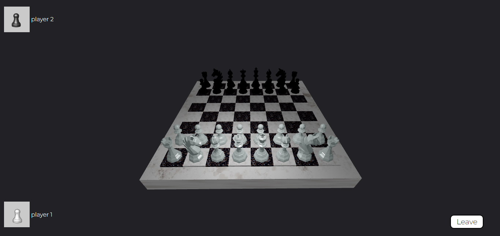

# Chess loop backend

# Chess loop

This website is a multiplayer game 3D chess. I developed this website with React, Three js for the scene 3D, gsap for some animations and the backend is made with Express js and socket io. You can play this chess with random players or you can create a room for play with your friends. The logic of the pieces movements is developed with JavaScript. 

[Chess loop](https://chess3dloop.netlify.app/)

[Repository frontend](https://github.com/AngelLunas/CHESS-3D)

